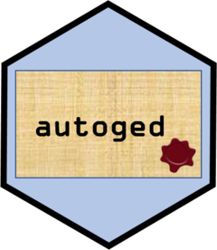

<!-- README.md is generated from README.Rmd. Please edit that file -->

# autoged 

<!-- badges: start -->

<!-- badges: end -->

Automate the storage of facts from source documents in family tree
GEDCOM files. Coming (not so) soon\!

The package is part of the `gedcompendium` ecosystem of packages. This
ecosystem enables the handling of `tidyged` objects (tibble
representations of GEDCOM files), and the main package of this ecosystem
is [`tidyged`](https://jl5000.github.io/tidyged/).


## Installation

You can install the development version from
[GitHub](https://github.com/) with:

``` r
# install.packages("devtools")
devtools::install_github("jl5000/autoged")
```
